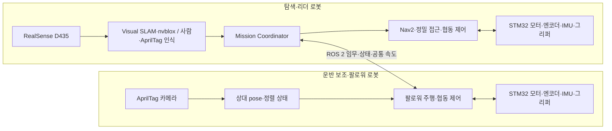

# 리더·팔로워 구조

## 문서 관점

이 문서는 [개발 계획서](Plan.md)의 **목표 구조**와 저장소에서 확인되는
**현재 구현**을 함께 설명합니다. 계획 토픽을 적어 놓았다는 것과 실제 노드가
발행·구독한다는 것은 다릅니다. 완료 여부는
[개발 현황 및 로드맵](STATUS_AND_ROADMAP.md)을 기준으로 판단합니다.

## 역할

탐색·리더 로봇은 D435 기반 3차원 지도와 생존자 위치를 만들고, Nav2 주행,
물품 선택, 단독 운반과 협동 운반의 공통 명령을 담당합니다.

운반 보조·팔로워 로봇은 리더의 임무 요청을 받아 물품으로 이동하고,
AprilTag 상대 위치로 정렬한 뒤 중량 물품의 협동 운반을 지원합니다.

두 로봇 모두 Jetson Orin과 ROS 2 Humble을 사용하고, 각 로봇의 STM32가
모터·엔코더·BNO055·그리퍼의 실시간 제어를 담당하는 것이 목표입니다.

현재 구현은 두 로봇의 AprilTag camera/base 상태와 software velocity pipeline, 리더 측
DDS 협력 명령 게이트를 제공합니다. 실제 hardware 주행과 Orin 간 현장 시험은 아직
남아 있습니다.



실선 전체는 목표 구조입니다. 현재 Leader/Follower AprilTag pipeline은 final software
velocity topic까지 구현됐지만 STM32/UART/motor에는 연결되지 않았습니다.

## 목표 인터페이스

### Orin–Orin

계획서에서 정한 이름은 다음과 같습니다. 메시지 타입, QoS, 발행 주기, timeout,
담당 노드와 fault 동작은 통합 전에 별도 인터페이스 계약으로 고정해야 합니다.

| 목표 이름 | 용도 | 현재 상태 |
| --- | --- | --- |
| `/leader/cmd_vel` | Leader guard의 최종 software 속도 | 구현, hardware 미연결 |
| `/follower/cmd_vel` | 기존 cooperation/upstream 명령 입력 | 구현, selector 입력이며 hardware 미연결 |
| `/leader/odom`, `/follower/odom` | 로봇별 wheel odometry | 미구현 |
| `/leader/imu`, `/follower/imu` | 로봇별 BNO055 IMU | 미구현 |
| `/follower/status` | 팔로워 heartbeat (현재 `std_msgs/String`) | 리더 구독 구현 |
| `/cooperation/state` | 협동 운반 상태 (`std_msgs/String`) | 리더 발행 구현 |
| `/cooperation/target_velocity` | 협동 운반 공통 속도 (`geometry_msgs/Twist`) | 리더 발행 구현 |
| `/mission/state` | 전체 임무 상태 (`std_msgs/String`) | 리더 발행 구현 |

### Orin–STM32

계획 기준으로 Orin은 좌우 바퀴 목표 속도와 그리퍼 명령을 내리고, STM32는
엔코더, 실제 바퀴 속도, BNO055 yaw, 그리퍼·fault 상태를 반환합니다. 속도 명령과
상태 보고의 목표 주기는 각각 50 Hz입니다.

구현 전 확정할 항목은 패킷 버전, 단위, byte order, sequence·timestamp, checksum,
timeout, 재연결, watchdog과 비상정지 우선순위입니다.

### TF와 namespace

토픽은 `/leader`, `/follower` namespace를 사용하지만 TF frame ID는 ROS namespace가
자동으로 분리해 주지 않습니다. 현재 리더 URDF에는 `base_link`, `camera_link`,
`imu_link`가 있고 팔로워 카메라에는 `follower_camera_optical_frame`이 있습니다.

두 로봇을 같은 ROS graph에서 실행하기 전에 다음을 고정해야 합니다.

1. 리더와 팔로워의 `base_link`, `odom`, 센서 frame이 충돌하지 않는 이름 규칙
2. 각 `base_link`에서 실제 camera optical frame과 `imu_link`까지의 정적 TF
3. 계획의 `map → odom → base_link` 체인에서 각 변환을 발행하는 단일 노드
4. AprilTag pose를 그리퍼 TCP 기준으로 변환하는 체인

## 현재 리더 파이프라인

`rescue_robot_bringup/camera_apriltag.launch.py`는 다음 노드를 실행합니다.

1. `realsense2_camera`: `/leader/camera` 네임스페이스의 RGB/depth 영상과 RealSense 센서 TF 발행
2. `robot_state_publisher`: `rescue_robot.urdf` 기반 TF 발행
3. `camera_info_qos_bridge.py`: CameraInfo QoS 연결 보조
4. `image_proc/rectify_node`: RGB 영상 보정
5. `apriltag_ros/apriltag_node`: `/leader/apriltag` 네임스페이스에서 태그 검출
6. `apriltag_approach_node`: `enable_approach:=true`일 때 기존 camera state와 exact-stamp
   `base_link` pose·metric·state 발행

기본 카메라 설정은 RGB/depth 모두 `640x480 @ 30Hz`이며, launch 인자
`enable_depth:=false`로 Depth를 끌 수 있습니다. AprilTag 설정은 `tag36h11`, ID `0`,
태그 크기 `0.050 m`입니다.

```bash
ros2 topic echo --once /leader/apriltag/detections
ros2 run tf2_ros tf2_echo camera_color_optical_frame 'leader/tag36h11:0'
```

Raw controller와 final guard는 별도 `leader_approach_control` launch로 실행하며, 둘 다
disabled로 시작합니다. 현재 base/controller target은 `0.25 m`의 provisional
software-validation 값입니다. 상세 계약은
[Leader velocity pipeline 검증 가이드](../src/leader/rescue_robot_apriltag/docs/LEADER_VELOCITY_PIPELINE_VALIDATION_GUIDE.md)를
참고합니다.

RGB 보정 영상은 `/leader/camera/color/image_rect`, Depth 원본 보정 영상은
`/leader/camera/depth/image_rect_raw`에서 확인합니다. 리더의 Depth 중앙 영역 측정은
다음 명령으로 실행하며, 저장 경로는 필요하면 파라미터로 지정합니다.

```bash
ros2 run rescue_robot_tools depth_to_csv.py --ros-args \
  -p output_path:=/home/maze/damgc_robot/data/depth_distance.csv
```

현재 launch의 URDF와 RealSense TF를 통해 `base_link → camera_color_optical_frame` chain을
구성하며, AprilTag base pose는 source observation timestamp의 exact-time TF2 변환을
사용합니다. 실물 장착 extrinsic은 최종 calibration 전 provisional 값입니다.

## 현재 팔로워 파이프라인

```text
/follower/camera/image_raw
        │
        ▼
image_proc/rectify_node → /follower/camera/image_rect
        │
        ▼
/follower/apriltag/apriltag → tag TF (예: tag36h11:0)
        │
        ▼
/follower/apriltag_approach → /follower/supply/*, /follower/alignment/state
```

접근 노드는 `follower_camera_optical_frame`에서 태그 TF를 조회하고, 유효한 관측을 중앙값 필터로 안정화한 뒤 다음 값을 발행합니다.

| 토픽 | 메시지 | 의미 |
| --- | --- | --- |
| `/follower/supply/detected` | `Bool` | 태그 검출 여부 |
| `/follower/supply/tag_id` | `Int32` | 선택된 태그 ID, 미검출 시 `-1` |
| `/follower/supply/relative_pose` | `PoseStamped` | 카메라 기준 태그 상대 pose |
| `/follower/supply/distance` | `Float64` | 3차원 거리 |
| `/follower/supply/lateral_error` | `Float64` | 좌우 오차 |
| `/follower/supply/straight_distance` | `Float64` | 전방 거리 |
| `/follower/supply/angle` | `Float64` | 접근 각도 |
| `/follower/alignment/state` | `String` | 접근 상태 |

## 상태 판단

```text
태그 없음/오래된 TF  → TAG_LOST
각도 오차가 큼        → TURN_LEFT / TURN_RIGHT
거리가 멂             → APPROACH
거리가 가까움         → TOO_CLOSE
좌우 오차가 큼         → FINE_ALIGN_LEFT / FINE_ALIGN_RIGHT
조건을 stable_time 동안 확인 중 → STABILIZING
거리·좌우·각도 조건을 stable_time 동안 만족 → ALIGNED
```

상태 이름과 임계값의 정확한 정의는 `src/follower/follower_supply_perception/docs/`를 기준으로 관리합니다.

## 향후 연결 지점

리더 DDS 게이트는 `leader_cooperation/leader_cooperation_node`로 제공됩니다.
`/cooperation/enable` (`std_srvs/SetBool`)을 `true`로 호출하고 팔로워 heartbeat가
신선할 때만 `/leader/cmd_vel`을 `/follower/cmd_vel`과
`/cooperation/target_velocity`로 전달합니다. heartbeat 또는 명령이 timeout되면
0 속도를 발행하며, fault 상태는 재-enable 전에 정지 상태를 유지합니다.

상위 행동 노드는 `/follower/alignment/state`와 상대 위치 토픽을 구독해 정밀 접근
후보 명령을 만들 수 있습니다. 다만 상태 문자열을 바로 모터 명령으로 변환하지 않고,
다음 안전 경계를 거쳐야 합니다.

```text
AprilTag pose·상태
  → 차체/TCP 기준 변환
  → 저속 접근 제어와 속도 제한
  → 장애물·TF stale·통신 watchdog·E-stop 검사
  → /follower/cmd_vel
  → Orin–STM32 bridge
```

계획 순서상 3주차에는 TF, odometry·IMU, 기본 주행과 E-stop을 먼저 만들고,
4주차에 AprilTag 저속 정렬과 파지 전 단계를 연결합니다.
