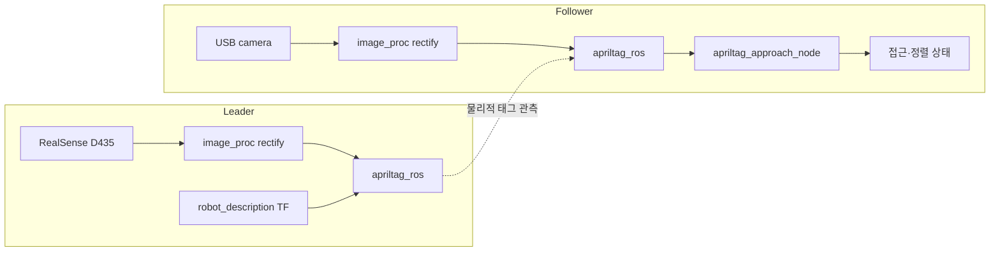

# 리더·팔로워 구조

## 역할

리더 Orin은 깊이 카메라와 로봇 모델을 포함한 기준 인식 플랫폼입니다. 팔로워는 USB 카메라로 AprilTag를 인식하고,
태그와의 상대 위치를 바탕으로 공급 대상에 접근할 준비가 되었는지 판단합니다.

현재 구현은 두 로봇의 인식 파이프라인을 각각 제공하는 단계입니다. 두 로봇 사이의 네트워크 통신이나 실제 주행 명령 전달은 아직 구현되어 있지 않습니다.



점선은 리더가 배치한/바라보는 태그를 팔로워가 카메라로 관측한다는 뜻이며, 현재 ROS 토픽으로 리더와 팔로워가 직접 연결된다는 뜻은 아닙니다.

## 리더 파이프라인

`rescue_robot_bringup/camera_apriltag.launch.py`는 다음 노드를 실행합니다.

1. `realsense2_camera`: `/leader/camera` 네임스페이스의 RGB/depth 영상과 RealSense 센서 TF 발행
2. `robot_state_publisher`: `rescue_robot.urdf` 기반 TF 발행
3. `camera_info_qos_bridge.py`: CameraInfo QoS 연결 보조
4. `image_proc/rectify_node`: RGB 영상 보정
5. `apriltag_ros/apriltag_node`: `/leader/apriltag` 네임스페이스에서 태그 검출

기본 카메라 설정은 RGB/depth 모두 `640x480 @ 30Hz`이며, launch 인자
`enable_depth:=false`로 Depth를 끌 수 있습니다. AprilTag 설정은 `tag36h11`, ID `0`,
태그 크기 `0.050 m`입니다.

```bash
ros2 topic echo --once /leader/apriltag/detections
ros2 run tf2_ros tf2_echo camera_color_optical_frame tag36h11:0
```

RGB 보정 영상은 `/leader/camera/color/image_rect`, Depth 원본 보정 영상은
`/leader/camera/depth/image_rect_raw`에서 확인합니다. 리더의 Depth 중앙 영역 측정은
다음 명령으로 실행하며, 저장 경로는 필요하면 파라미터로 지정합니다.

```bash
ros2 run rescue_robot_tools depth_to_csv.py --ros-args \
  -p output_path:=/home/maze/damgc_robot/data/depth_distance.csv
```

URDF의 `camera_link`와 RealSense가 발행하는 `camera_color_optical_frame`은 현재
별도 프레임입니다. 따라서 리더 URDF 모델의 카메라 형상과 RealSense 센서 TF가
자동으로 하나의 TF 체인으로 연결된다고 보장하지 않으며, 실물 장착 기준의 정적 TF가
필요하면 별도로 추가해야 합니다.

## 팔로워 파이프라인

```text
/follower/camera/image_raw
        │
        ▼
image_proc/rectify_node → /follower/camera/image_rect
        │
        ▼
/follower/apriltag/apriltag → tag TF (예: tag36h11:0)
        │
        ▼
/follower/apriltag_approach → /follower/supply/*, /follower/alignment/state
```

접근 노드는 `follower_camera_optical_frame`에서 태그 TF를 조회하고, 유효한 관측을 중앙값 필터로 안정화한 뒤 다음 값을 발행합니다.

| 토픽 | 메시지 | 의미 |
| --- | --- | --- |
| `/follower/supply/detected` | `Bool` | 태그 검출 여부 |
| `/follower/supply/tag_id` | `Int32` | 선택된 태그 ID, 미검출 시 `-1` |
| `/follower/supply/relative_pose` | `PoseStamped` | 카메라 기준 태그 상대 pose |
| `/follower/supply/distance` | `Float64` | 3차원 거리 |
| `/follower/supply/lateral_error` | `Float64` | 좌우 오차 |
| `/follower/supply/straight_distance` | `Float64` | 전방 거리 |
| `/follower/supply/angle` | `Float64` | 접근 각도 |
| `/follower/alignment/state` | `String` | 접근 상태 |

## 상태 판단

```text
태그 없음/오래된 TF  → TAG_LOST
각도 오차가 큼        → TURN_LEFT / TURN_RIGHT
거리가 멂             → APPROACH
거리가 가까움         → TOO_CLOSE
좌우 오차가 큼         → FINE_ALIGN_LEFT / FINE_ALIGN_RIGHT
조건을 stable_time 동안 확인 중 → STABILIZING
거리·좌우·각도 조건을 stable_time 동안 만족 → ALIGNED
```

상태 이름과 임계값의 정확한 정의는 `src/follower/follower_supply_perception/docs/`를 기준으로 관리합니다.

## 향후 연결 지점

상위 행동 노드는 `/follower/alignment/state`와 상대 위치 토픽을 구독하여 주행·정지·그리퍼 동작을 결정할 수 있습니다.
실제 동작 전에는 `base_link` 기준 좌표 변환, 속도 제한, 통신 끊김 시 정지, STM32/그리퍼 인터페이스를 확정해야 합니다.
